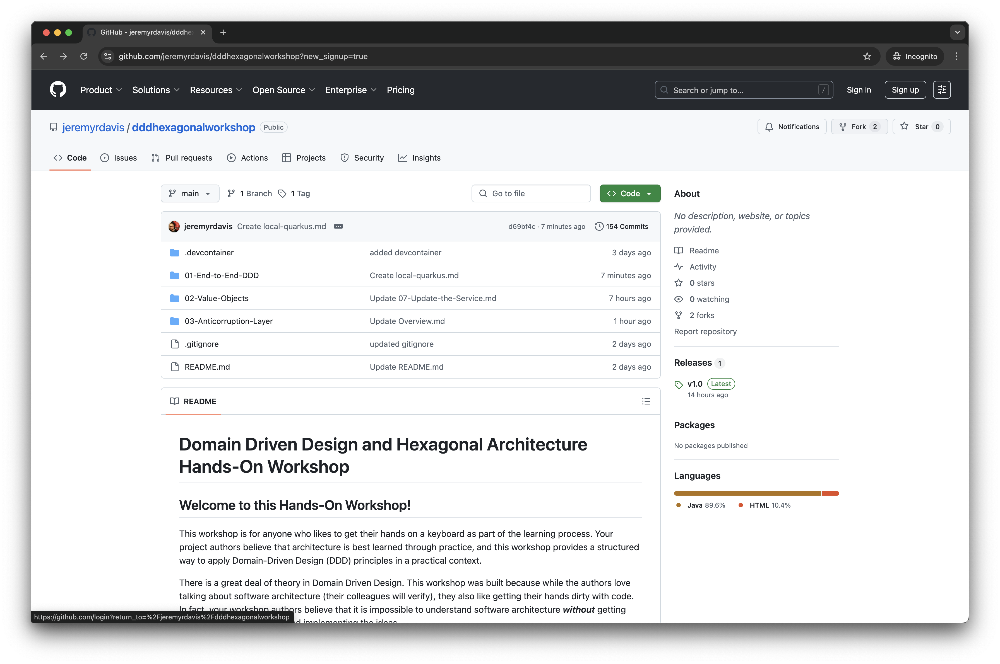
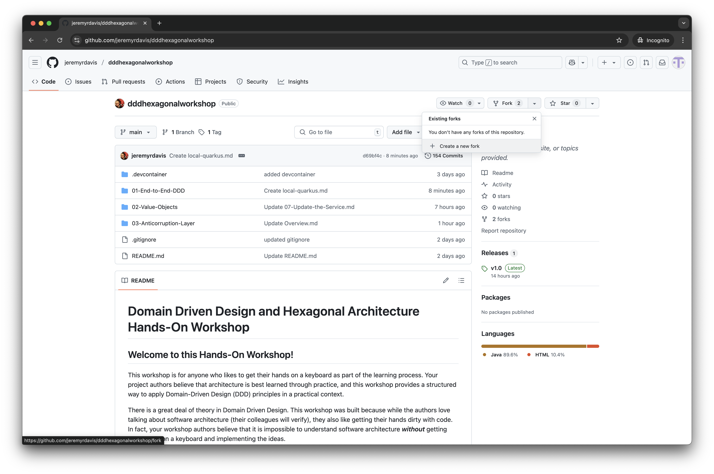
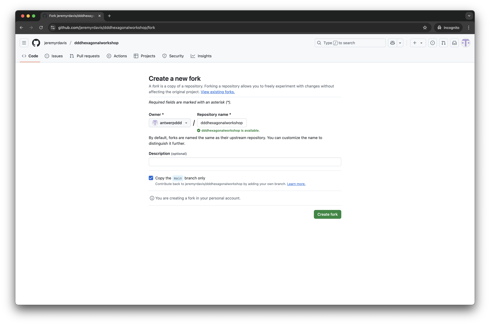
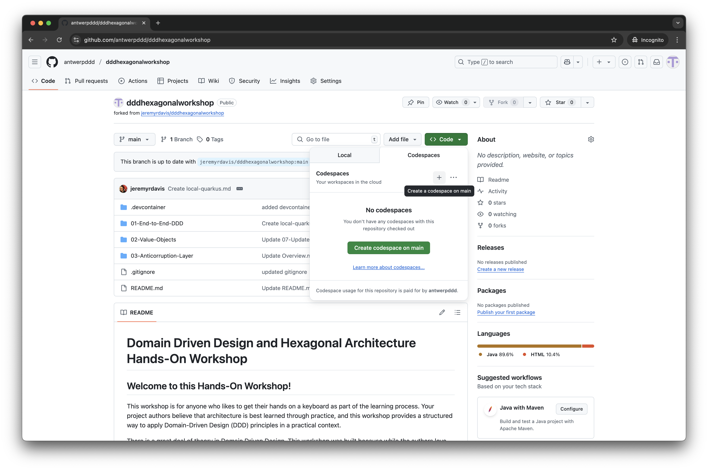
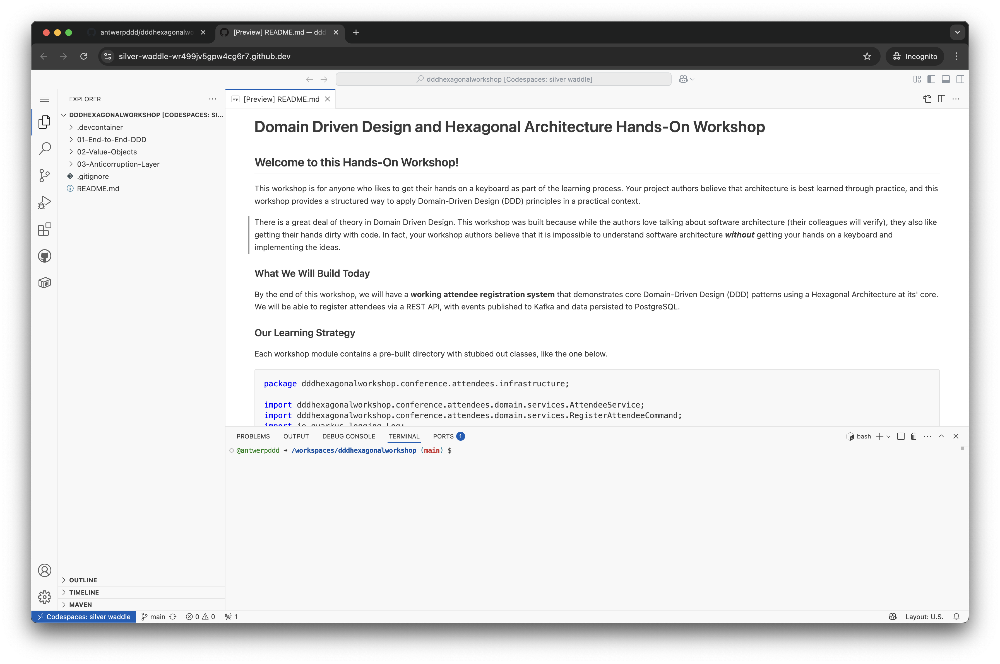
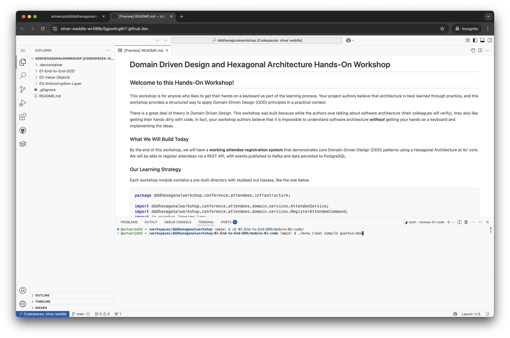
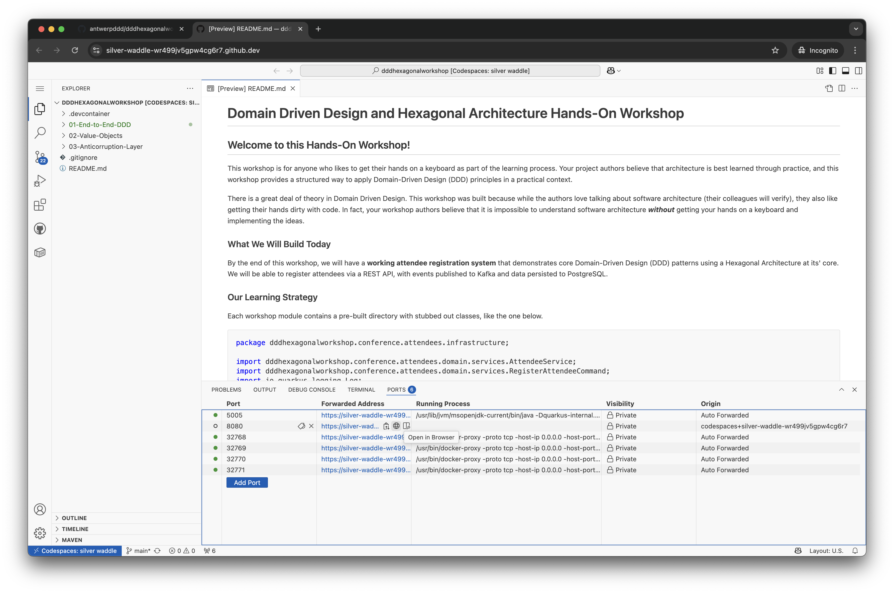
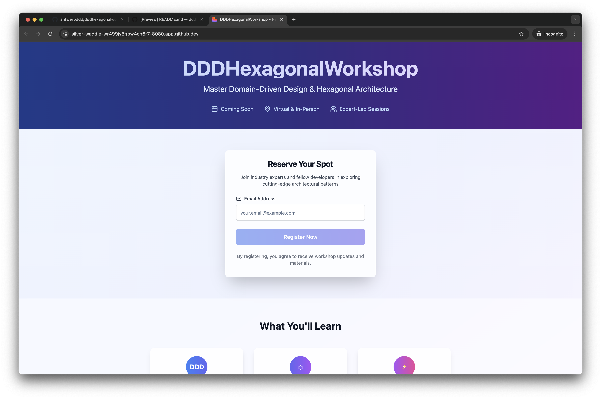

# GitHub Codespaces

1. Fork the repository: https://github.com/jeremyrdavis/dddhexagonalworkshop
2. Open an instance of Codespaces on main
3. In the terminal change into the module directory, `01-End-to-End-DDD`

```bash
cd 01-End-to-End-DDD
```

4. Change into the source code directory:

```bash
cd module-01-code
```

5. Start Quarkus:

```bash
./mvnw clean compile quarkus:dev
```

6. You will receive a popup message, "Your application running on port 5005 is available. See all forwarded ports."  Close this dialog box.
7. Click on the "Ports" tab
8. Click on the globe icon next to Port 8080.  This will open the website for Module 1 in a new tab.
9. You are ready to start!


















