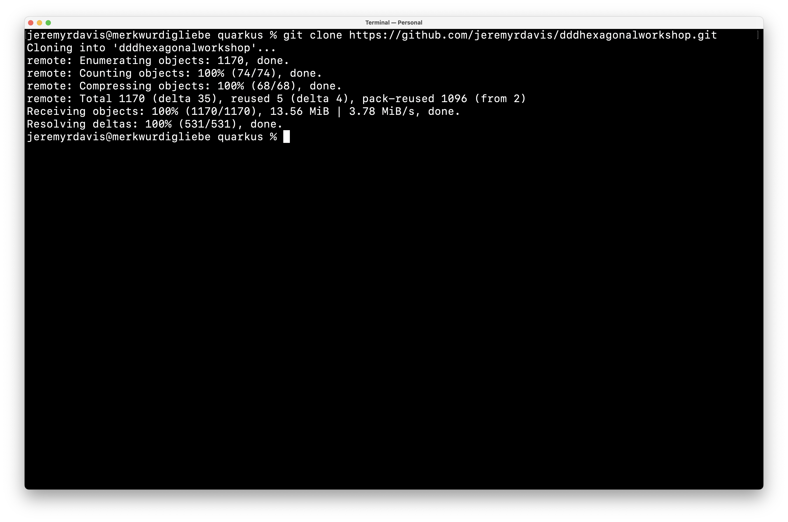
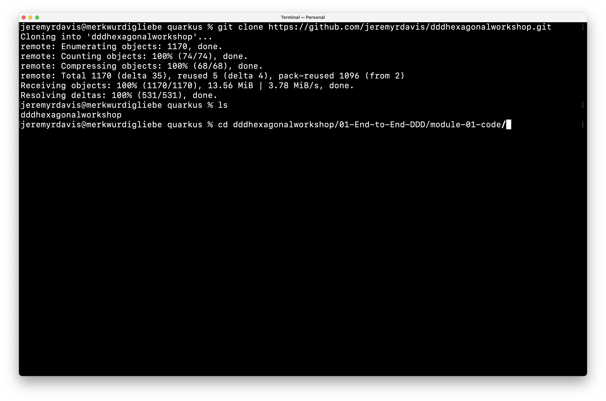
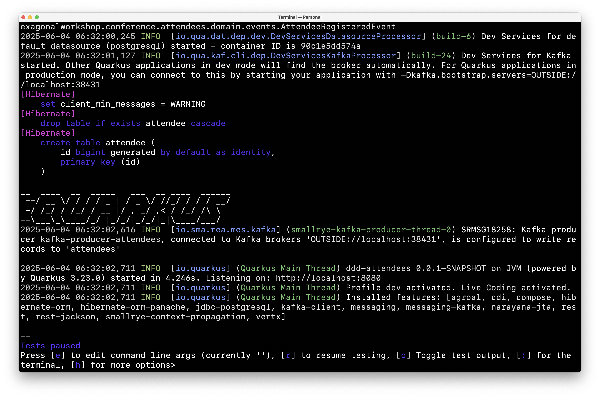
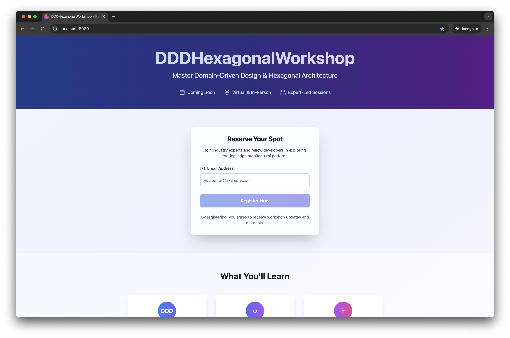

# Quarkus Local

1. Clone the repository: https://github.com/jeremyrdavis/dddhexagonalworkshop
2. Open the code in your favorite IDE
3. In the terminal change into the module directory, `dddhexagonalworkshop/01-End-to-End-DDD/module-01-code`

```bash
cd 01-End-to-End-DDD/module-01-code
```

4. Start Quarkus:

```bash
./mvnw clean compile quarkus:dev
```

5. Open a browser at http://locahost:8080
   
7. 9. You are ready to start!










Get started with Module 1: [Module 1 Overview](01-End-to-End-DDD/Overview.md)
