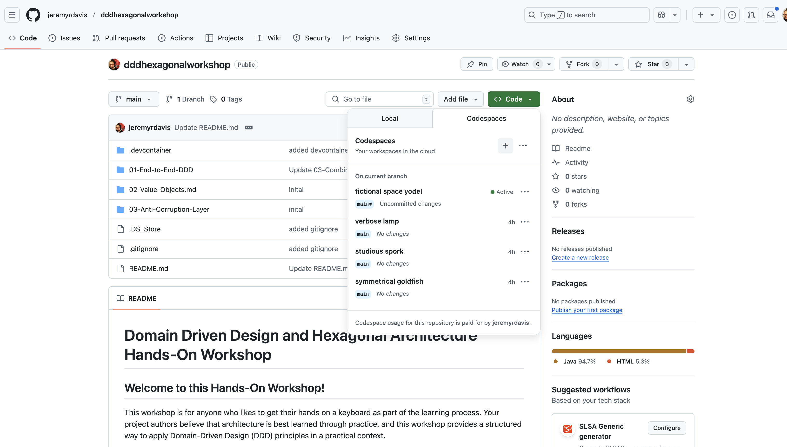
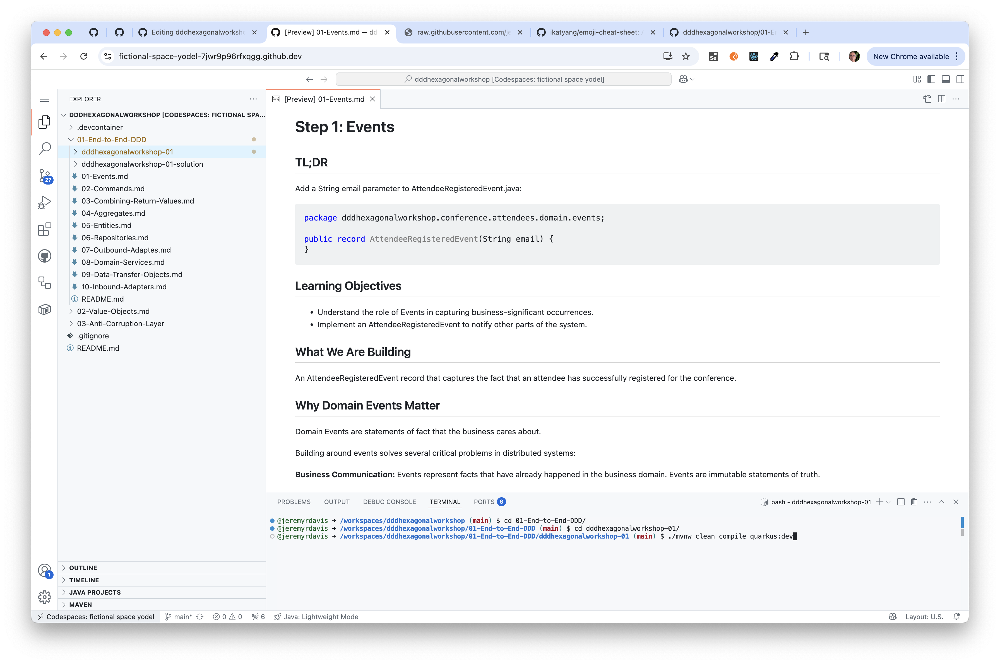

# Domain Driven Design and Hexagonal Architecture Hands-On Workshop

## Welcome to this Hands-On Workshop!

This workshop is for anyone who likes to get their hands on a keyboard as part of the learning process. Your project authors believe that architecture is best learned through practice, and this workshop provides a structured way to apply Domain-Driven Design (DDD) principles in a practical context.

There is a great deal of theory in Domain Driven Design. This workshop was built because while the authors love talking about software architecture (their colleagues will verify), they also like getting their hands dirty with code. In fact, your workshop authors believe that it is impossible to understand software architecture **_without_** getting your hands on a keyboard and implementing the ideas.

### What We Will Build Today

By the end of this workshop, we will have a **working attendee registration system** that demonstrates core Domain-Driven Design (DDD) patterns using a Hexagonal Architecture at its' core. We will be able to register attendees via a REST API, with events published to Kafka and data persisted to PostgreSQL.

### Our Learning Strategy

Each workshop module contains a pre-built directory with stubbed out classes, like the one below.

```java
package dddhexagonalworkshop.conference.attendees.infrastructure;

import dddhexagonalworkshop.conference.attendees.domain.services.AttendeeService;
import dddhexagonalworkshop.conference.attendees.domain.services.RegisterAttendeeCommand;
import io.quarkus.logging.Log;
import jakarta.inject.Inject;
import jakarta.ws.rs.*;
import jakarta.ws.rs.core.MediaType;
import jakarta.ws.rs.core.Response;

import java.net.URI;


/**
 * "The application is blissfully ignorant of the nature of the input device. When the application has something to send out, it sends it out through a port to an adapter, which creates the appropriate signals needed by the receiving technology (human or automated). The application has a semantically sound interaction with the adapters on all sides of it, without actually knowing the nature of the things on the other side of the adapters."
 * Alistair Cockburn, Hexagonal Architecture, 2005.
 *
 */
public class AttendeeEndpoint {
}

```

The documentation contains the code to complete the classes:

```java
package dddhexagonalworkshop.conference.attendees.infrastructure;

import dddhexagonalworkshop.conference.attendees.domain.services.AttendeeService;
import dddhexagonalworkshop.conference.attendees.domain.services.RegisterAttendeeCommand;
import io.quarkus.logging.Log;
import jakarta.inject.Inject;
import jakarta.ws.rs.*;
import jakarta.ws.rs.core.MediaType;
import jakarta.ws.rs.core.Response;

import java.net.URI;


/**
 * "The application is blissfully ignorant of the nature of the input device. When the application has something to send out, it sends it out through a port to an adapter, which creates the appropriate signals needed by the receiving technology (human or automated). The application has a semantically sound interaction with the adapters on all sides of it, without actually knowing the nature of the things on the other side of the adapters."
 * Alistair Cockburn, Hexagonal Architecture, 2005.
 *
 */
@Path("/attendees")
@Consumes(MediaType.APPLICATION_JSON)
@Produces(MediaType.APPLICATION_JSON)
public class AttendeeEndpoint {

    @Inject
    AttendeeService attendeeService;

    @POST
    public Response registerAttendee(RegisterAttendeeCommand registerAttendeeCommand) {
        Log.debugf("Creating attendee %s", registerAttendeeCommand);

        AttendeeDTO attendeeDTO = attendeeService.registerAttendee(registerAttendeeCommand);

        Log.debugf("Created attendee %s", attendeeDTO);

        return Response.created(URI.create("/" + attendeeDTO.email())).entity(attendeeDTO).build();
    }

}
```

You can implement the classes by typing in the supplied code, which is your workshop authors preferred method because we believe it is easier to remember that way, or by copying and pasting.  Each step will cover a particular DDD topic.

The examples are not meant to be reflect a production system so you will find, for instance, that validation might not be as complete as it would in a real application.

### :rocket: tl;dr

Each step starts with a **tl;dr** section containing only code.  If you want to get the application up and running as quickly as possible you can copy/paste the code into the stubbed classes without reading the rest of the material.

We think this can be a good approach if you are as impatient as (one of) us, but we hope you go back through the material and read through each step.

---

## Workshop Overview

### What We Are Building

A conference attendee registration microservice with:

- **REST API** for registering attendees
- **Business logic** that validates registrations
- **Event publishing** to notify other systems
- **Database persistence** for attendee data
- **Clean architecture** that separates concerns

### The Journey (4 Modules)

We'll build this system step-by-step, with each piece compiling as we go:

| Iteration | Component                 | Focus                                                                 |
| --------- | ------------------------- | --------------------------------------------------------------------- |
| 01        | **End to End DDD**        | Implement a (very) basic workflow                                     |
| 02        | **Value Objects**         | Add more detail to the basic workflow                                 |
| 03        | **Anti-Corruption Layer** | Implement an Anti Corruption Layer to integrate with external systems |
| 04        | **Testability**           | Focus on testing                                                      |

---

### Module 1 (10 Steps)

We'll build this system step-by-step, with each piece compiling as we go:

| Step | Component           | Focus                       |
| ---- | ------------------- | --------------------------- |
| 01   | **Events**          | Capture business facts      |
| 02   | **Commands**        | Represent business requests |
| 03   | **Result Objects**  | Combine multiple outputs    |
| 04   | **Aggregates**      | Core business logic         |
| 05   | **Entities**        | Database mapping            |
| 06   | **Repositories**    | Data access layer           |
| 07   | **Event Publisher** | Messaging integration       |
| 08   | **Domain Services** | Workflow orchestration      |
| 09   | **DTOs**            | API data contracts          |
| 10   | **REST Endpoint**   | HTTP interface              |

---

### Module 2 (7 Steps)

We'll build this system step-by-step, with each piece compiling as we go:

| Step | Component                              | Focus                       |
| ---- | -------------------------------------- | --------------------------- |
| 01   | **Create the Address Value Object**    | Capture business facts      |
| 02   | **Update the RegisterAttendeeCommand** | Represent business requests |
| 03   | **Update the Attendee Aggregate**      | Package multiple outputs    |
| 04   | **Update the AttendeeRegisteredEvent** | Core business logic         |
| 05   | **Update the Persistence Layer**       | Database mapping            |
| 06   | **Update the AttendeeService**         | Data access layer           |
| 07   | **Update the AttendeeDTO**             | Messaging integration       |

---

### Module 3 (7 Steps)

We'll build this system step-by-step, with each piece compiling as we go:

| Step | Component                              | Focus                       |
| ---- | -------------------------------------- | --------------------------- |
| 01   | **Create the Address Value Object**    | Capture business facts      |
| 02   | **Update the RegisterAttendeeCommand** | Represent business requests |
| 03   | **Update the Attendee Aggregate**      | Package multiple outputs    |
| 04   | **Update the AttendeeRegisteredEvent** | Core business logic         |
| 05   | **Update the Persistence Layer**       | Database mapping            |
| 06   | **Update the AttendeeService**         | Data access layer           |
| 07   | **Update the AttendeeDTO**             | Messaging integration       |


## Key Concepts We'll Experience

### Domain-Driven Design (DDD)

- **Business logic in the right place** - not scattered across layers
- **Rich domain models** that express business concepts clearly
- **Clean separation** between business rules and technical concerns

### Hexagonal Architecture

- **Ports and Adapters** pattern that keeps your core domain pure
- **Technology independence** - swap databases or frameworks easily
- **Testable design** with clear boundaries

### The Big Picture

```
External World → REST → Domain Logic → Events → External Systems
     ↓              ↓         ↓           ↓           ↓
  HTTP Requests → Commands → Aggregates → Events → Kafka
                     ↓         ↓           ↓
                  DTOs ← Domain Service → Repository → Database
```

---

## Workshop Rules for Success

### ✅ **Do This:**

- **Follow along step-by-step** - don't jump ahead
- **Copy code exactly** - before experimenting.  Once everything is working, experiment all you want
- **Ask for help** if you get stuck

### ❌ **Avoid This:**

- **Don't optimize or change the code** - get it working first
- **Don't get stuck on theory questions** - ask theory questions!
- **Don't get stuck on implementation questions** - ask implementation questions!

### 🆘 **If You Fall Behind:**

- **Don't panic** - the goal is learning, not perfection
- **Revisit at a later date** - the workshop will be on GitHub, the authors are easy to get in touch with, and happy to help at any time

---

## Hands-on-Keyaboards Checklist 

There are three ways to do the workshop:

- GitHub Codespace
- Quarkus' Dev Mode on your laptop
- Quarkus and Docker Compose on your laptop

### GitHub Codespaces

- Clone the workshop repository
- Open the repo in a Codespace
- Open the Workshop files from the file menu on the left
- In the Terminal change into the 01-End-to-End-DDD/dddhexagonalarchitecture-01 directory with the following commands:

```bash
(main) $ cd 01-End-to-End-DDD/dddhexagonalarchitecture-01
(main) $ ./mvnw clean compile quarkus dev
```
- Click on "Ports" and click on the globe icon in the row for port 8080, which is where Quarkus is running, and the application will open in a new browser tab





### Required Setup (Should be done already)

- [ ] **Java 21+** installed and working
- [ ] **Maven 3.8+** installed and working
- [ ] **IDE** (IntelliJ, VS Code, Eclipse) ready
- [ ] **Workshop repository** cloned
- [ ] **Starter project** compiles: `mvn compile`

## Get Started!

[01 End to End DDD](01-End-to-End-DDD/README.md)
