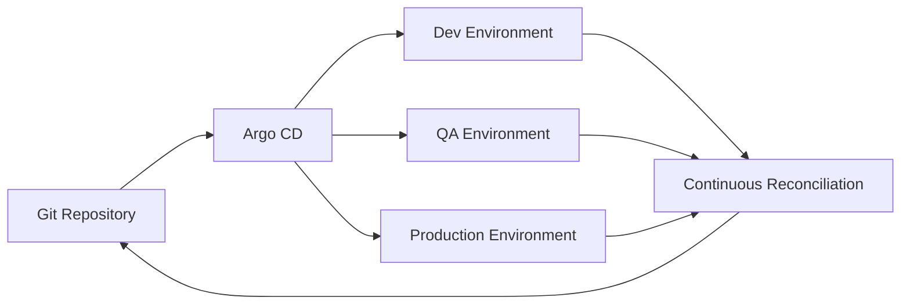
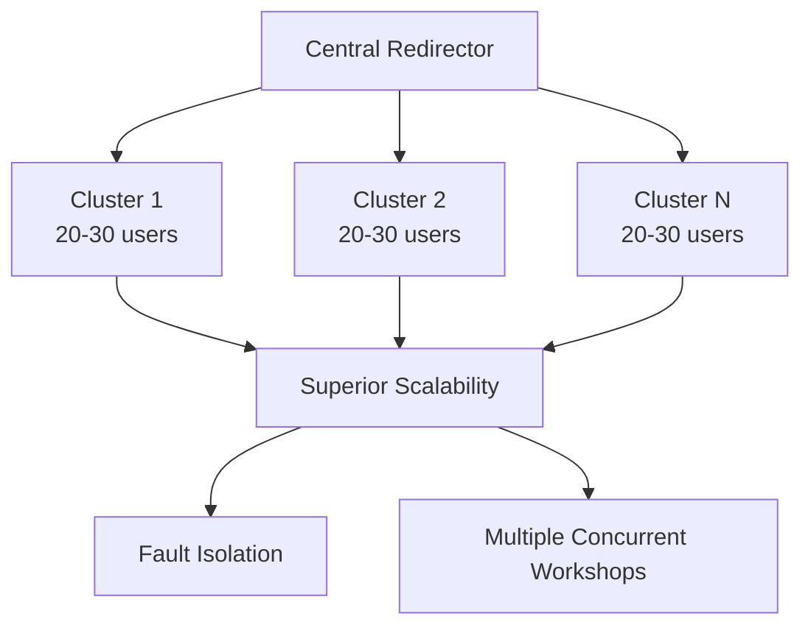

# Technical Feasibility Study for ADR-0001 to ADR-0005: An Analysis of the Proposed OpenShift Workshop Architecture

## Executive Summary

This report presents a comprehensive technical feasibility study of the architectural decisions (ADRs) proposed for a multi-user technical workshop environment based on Red Hat OpenShift Dev Spaces. The analysis validates the technical viability of each ADR against the project's research objectives, success criteria, and constraints. The findings are based on a rigorous evaluation of established industry practices, platform documentation, and performance benchmarks for the core technologies involved, including OpenShift, Quarkus, Tekton, and Argo CD.

The overall assessment concludes that the proposed architecture is **conditionally feasible**. While the foundational components and strategies are technically sound and align with modern cloud-native principles, achieving the desired levels of performance, reliability, and user experience is contingent upon specific platform tuning, precise resource allocation, and a pragmatic re-evaluation of certain performance expectations.

## Key Findings Synopsis

### ADR-0001 (Inner Loop Development Architecture): Feasible, with High Risk to Performance Criteria

The OpenShift Dev Spaces platform is capable of supporting 20+ concurrent users from an infrastructure standpoint. However, the success criterion of achieving live reload times of less than 3 seconds under concurrent load is at **significant risk**. This is due to the inherent design of Quarkus development mode, which prioritizes single-user iteration speed over concurrent performance. The primary platform-level risk is not worker node resource exhaustion but the potential for control plane instability, specifically etcd contention, as the number of user workspaces increases.

### ADR-0002 (Sidecar Pattern Resource Requirements): Feasible

The hypothesized resource allocations for PostgreSQL (512Mi) and Kafka (1Gi) sidecars are sufficient to ensure stability. However, they are likely over-provisioned for the low-intensity, intermittent workload profile of a technical workshop. This presents a significant opportunity for cost optimization through right-sizing, which can improve cluster density and reduce operational expenditures.

### ADR-0003 & ADR-0005 (Inner/Outer Loop Integration & CI/CD Performance): Feasible

The integration between the inner loop (Dev Spaces) and the outer loop (Tekton CI/CD pipeline) is a well-defined and reliable pattern, primarily orchestrated through the devfile specification. The target of completing a full pipeline run in under 15 minutes is achievable, but it will require deliberate optimization strategies, such as dependency caching and a tiered approach to security scanning, which is identified as the most probable bottleneck.

### ADR-0004 (Environment Progression Reliability): Feasible and Highly Recommended

The proposed three-tier environment progression (Dev → QA → Production) managed via a GitOps workflow with Argo CD is a robust and highly reliable strategy. This approach not only ensures configuration parity and prevents drift but also enhances the pedagogical value of the workshop by demonstrating industry best practices in a tangible way.

## Critical Risks Summary

The most critical risks identified in this study are:

1. **Degradation of Developer Experience**: A high probability that concurrent live reload operations by 20+ participants will lead to response times significantly exceeding the 3-second target, causing user frustration and disrupting the workshop's flow.
2. **Control Plane Instability**: A moderate probability that a high number of concurrent user workspaces could lead to etcd datastore contention, resulting in cluster-wide API slowdowns that affect all participants simultaneously.
3. **CI/CD Pipeline Bottlenecks**: A very high probability that comprehensive security scans will cause the CI/CD pipeline to exceed its 15-minute execution time target, delaying feedback to participants and impacting the workshop schedule.

## Strategic Recommendations Overview

To mitigate these risks and ensure the project's success, this study recommends:

- **Re-evaluating Performance Success Criteria**: Replace the static < 3 second live reload target with a more realistic, tiered performance objective that acknowledges an acceptable degradation under concurrent load.
- **Implementing Proactive Platform Monitoring and Tuning**: Establish comprehensive monitoring for the OpenShift control plane, particularly etcd, and apply low-latency tuning profiles to worker nodes hosting developer workspaces.
- **Adopting a Tiered CI/CD Security Strategy**: Implement a multi-layered security scanning approach within the Tekton pipeline, performing rapid, non-blocking scans on developer commits and reserving comprehensive, blocking scans for formal promotion events.
- **Enforcing a "Golden Path" Devfile**: Standardize the development environment and the inner-to-outer loop handoff by providing all participants with a version-controlled, centrally managed devfile template.

---

## Section 1: Analysis of the Inner Loop Development Environment (ADR-0001)

This section evaluates the feasibility of the proposed inner loop development architecture (ADR-0001), which relies on Red Hat OpenShift Dev Spaces to provide a consistent and performant development environment for 20+ concurrent workshop participants using Quarkus applications. The analysis focuses on platform scalability, the performance characteristics of Quarkus live reload, and the impact of network latency.

### 1.1 Scalability of OpenShift Dev Spaces for Concurrent Workshops

The core of the proposed architecture is **Red Hat OpenShift Dev Spaces**, the enterprise-supported product built upon the open-source Eclipse Che project. This platform is designed to provide containerized, one-click developer workspaces that are managed as native Kubernetes resources, offering a consistent and centrally governed development environment.

The architectural model of Dev Spaces provisions each user workspace as a **DevWorkspace Custom Resource**. This, in turn, results in the creation of a dedicated OpenShift project (Kubernetes namespace) and one or more pods to host the IDE and application runtime. While this architecture provides strong isolation between participants—a critical requirement for a workshop setting—it introduces a non-trivial amount of overhead on the Kubernetes control plane.

#### Control Plane Performance Considerations

The stability of the entire platform is not just a function of the resources available to the worker nodes but is deeply tied to the performance of the control plane, particularly the **etcd datastore**.

Performance benchmarks and scalability studies conducted on the upstream Eclipse Che project provide critical data in this area:

- Research on running Che at scale reveals that **etcd is a primary performance bottleneck**
- Load tests demonstrated that creating 6,000 DevWorkspace objects consumed approximately **2.5GB of etcd storage**, which begins to approach the recommended maximum of 8GB for a stable cluster
- Each workspace creates a cascade of Kubernetes objects: Namespaces, DevWorkspaces, Pods, Services, Secrets, and ConfigMaps

While the proposed workshop scale of 20+ concurrent users is far from this 6,000-user limit, the principle remains salient: the number of objects managed by the control plane, not just the computational load on the workers, is a key factor in overall platform reliability.

> **Critical Finding**: A slow or overloaded etcd datastore would manifest as a cluster-wide degradation in API responsiveness, affecting all participants simultaneously and violating the "Zero environment-related support tickets" success criterion.

#### Recommended Resource Allocation

To mitigate this, Red Hat's official scalability and performance documentation for OpenShift Container Platform recommends:

- Keep overall CPU and memory resource usage on control plane nodes to **at most 60% of available capacity**
- This buffer is essential to handle resource usage spikes during concurrent operations
- When scaling worker nodes, do so incrementally—in batches of **no more than 25 to 50 machines at once**

### 1.2 Performance of Quarkus Remote Live Reload under Concurrent Load

The central feature for the workshop's developer experience is **Quarkus's live reload capability**. It is crucial to understand that Quarkus development mode is explicitly engineered for "developer joy" in a single-user context, not for optimized performance under concurrent load.

#### Architecture Limitations

In dev mode, Quarkus employs a sophisticated ClassLoader hierarchy that enables the hot deployment of modified user code without requiring a full rebuild and restart of the application. However, this comes at a cost:

- **Many more classes are loaded into memory**
- **Build-time operations** are re-executed every time a live reload is triggered
- The **JVM's highly optimizing C2 compiler is disabled by default** in dev mode
- Running code is not as performant as it would be in a production setting

#### Remote Development Mode

Quarkus provides explicit support for a **remote development mode**, designed for containerized environments like OpenShift Dev Spaces:

```bash
# Remote development mode operation flow
1. Developer saves a file in Dev Spaces container
2. Local agent detects the change
3. HTTP-based long polling synchronizes with remote running application pod
4. Browser refresh triggers workspace scan
5. Java files are compiled and application is redeployed on the fly
```

> **Performance Risk**: The hypothesis that this process can reliably complete in under 3 seconds for 20+ concurrent workshop participants is at **high risk**. The architecture's reliance on background compilation and redeployment for each user's request is highly likely to create significant resource contention on the shared worker nodes.

### 1.3 Impact of Network Latency on Developer Experience

In the proposed remote development architecture, network latency can impact the user experience at two critical junctures:

1. **User-to-IDE Latency**: Between participant's web browser and the in-browser IDE served from OpenShift Dev Spaces pod
2. **Intra-Cluster Latency**: Between various containers that constitute the development environment

#### Mitigation Strategies

OpenShift provides advanced mechanisms for managing network performance:

- **Node Tuning Operator**: Apply specific tuning profiles to nodes for low-latency workloads
- **Worker Latency Profiles**: Configure cluster stability in high-latency environments by adjusting Kubelet configurations

### 1.4 Findings and Recommendations

The analysis of ADR-0001 reveals that while the foundational platform is sound, the performance expectations may be unrealistic due to a misunderstanding of the underlying technology's design principles.

#### Key Findings

1. **Scalability Challenge**: The true challenge is not simply about providing sufficient CPU and memory to worker nodes; it's a complex interplay between control plane stability and performance characteristics under concurrent load.
2. **Performance Misalignment**: The success criterion of achieving live reload times under 3 seconds under concurrent load is fundamentally misaligned with the design philosophy of Quarkus dev mode.

#### Recommendations

1. **Validate Feasibility with Scaled Load Test**

   - Expand monitoring scope to include control plane metrics
   - Monitor etcd leader election times, write latency, and API server responsiveness via Prometheus
2. **Re-evaluate the Live Reload Success Criterion**

   ```
   Proposed Alternative: "The 95th percentile of live reload operations 
   completes in under 5 seconds when subjected to a load of 20 concurrent users."
   ```
3. **Implement Proactive Cluster Tuning**

   - Utilize OpenShift Node Tuning Operator for performance profiles
   - Apply low-latency optimization to worker nodes hosting Dev Spaces workspaces
4. **Plan for Future Scale with Multi-Cluster Architecture**

   - For larger workshops, investigate multi-cluster redirector architecture
   - Distribute control plane load across multiple independent OpenShift clusters

---

## Section 2: Resource Requirements and Optimization for Stateful Sidecars (ADR-0002)

This section assesses the feasibility of ADR-0002, which defines the resource requirements for the PostgreSQL and Kafka sidecar containers. The analysis validates the hypothesized memory allocations against industry best practices for running stateful services in Kubernetes, considering the specific low-intensity workload profile of a technical workshop.

### 2.1 PostgreSQL Sidecar Resource Validation

The use of the **sidecar pattern** to provide a dedicated PostgreSQL database for each participant's application is a sound architectural choice. It effectively isolates each user's data and offloads the database management responsibility from the main application container.

#### Best Practices for Resource Management

A critical best practice when implementing this pattern is the **explicit definition of resource requests and limits** for every container within the pod:

- **Kubernetes uses the sum of all container requests** to make scheduling decisions
- **Uses the limits to enforce a hard cap** on resource consumption
- Failing to set these values can lead to resource contention and unpredictable performance

#### PostgreSQL Configuration Parameters

The performance and memory consumption of a PostgreSQL instance are governed by several key configuration parameters:

- **`shared_buffers`**: Controls memory dedicated to database's page cache (typically ~25% of total RAM in server environments)
- **`work_mem`**: Defines memory allocated per sorting or hashing operation within a query

For containerized instances with small memory footprints, these values must be tuned down significantly from server-based defaults.

#### Workshop Workload Profile

The workload profile for a workshop is characterized by:

- **Infrequent, simple queries**
- **Very small data volumes**
- **Stark contrast to production environments** with heavy transactional loads

> **Resource Assessment**: The hypothesized memory allocation of **512Mi is a safe and reasonable starting point** for a limit, ensuring the container has enough headroom to avoid OOM killer termination.

**Recommended Configuration:**

- **Memory Limit**: 512Mi
- **Memory Request**: 256Mi (more efficient for Kubernetes scheduler bin-packing)

### 2.2 Kafka Sidecar Resource Validation

Deploying Apache Kafka in a Kubernetes environment presents unique challenges, primarily because its performance is heavily dependent on the host's **filesystem page cache**, which can be less predictable in a containerized, multi-tenant environment.

#### Workshop-Specific Considerations

For workshop sidecar purposes:

- **Minimal workload**: Demonstrate event-driven concepts
- **Low throughput**: Only a handful of messages per participant
- **Full-scale Kafka cluster configuration is unnecessary**

#### JVM Heap Sizing

As Kafka is a Java-based application, one of the most critical configuration aspects is **correctly sizing the JVM heap**:

```bash
# Common Critical Error
# Setting maximum heap size (-Xmx) too close to container's memory limit
# Leaves insufficient room for:
# - Metaspace (class metadata)
# - Thread stacks  
# - JIT code cache
# Results in: OOMKilled errors

# Best Practice
# Set JVM heap size to no more than 50-70% of container's memory limit
```

#### Resource Optimization

The hypothesized memory allocation of **1Gi for a single-broker, low-throughput Kafka instance is likely over-provisioned**.

**Recommended Configuration:**

- **Memory Limit**: 1Gi (safety buffer)
- **Memory Request**: 512Mi (resource efficiency)
- **JVM Max Heap**: 256Mi to 300Mi (within the 512Mi request)

### 2.3 Cost Implications and Optimization

The cumulative resource consumption of 20+ complete developer workspaces represents a **substantial and ongoing operational cost**.

#### Cost Monitoring Tools

- **Red Hat Cost Management**: Based on upstream Koku project
- **OpenCost**: Open-source alternative
- Both integrate with cloud provider billing APIs and OpenShift internal metrics

#### Optimization Opportunity

The **single most impactful opportunity for cost optimization** lies in right-sizing the sidecar containers:

**Impact Analysis:**

- Reducing PostgreSQL sidecar from 512Mi to 256Mi request
- Reducing Kafka sidecar from 1Gi to 512Mi request
- **Total reserved memory reduction for 20 users: over 14Gi**
- Direct translation to lower cloud provider bills

### 2.4 Findings and Recommendations

The analysis of ADR-0002 confirms that the proposed sidecar pattern is **feasible and that the hypothesized resource allocations are safe, albeit inefficient**.

#### Sidecar Resource Allocation Recommendations

| Service    | Hypothesized Allocation | Recommended Request | Recommended Limit | Rationale / Key Tuning Parameters                                                                                                              |
| ---------- | ----------------------- | ------------------- | ----------------- | ---------------------------------------------------------------------------------------------------------------------------------------------- |
| PostgreSQL | 512Mi                   | 256Mi               | 512Mi             | Workshop workload involves low transaction volume and minimal data. Configure `shared_buffers` and `work_mem` for small memory footprint.  |
| Kafka      | 1Gi                     | 512Mi               | 1Gi               | Workshop requires very low message throughput. Set JVM heap size (-Xmx) to ~50-60% of memory request (e.g., 256m) to prevent OOMKilled errors. |

#### Strategic Recommendations

1. **Adopt "Request Low, Limit High" Resource Strategy**

   - Implement resource requests and limits per Table above
   - Optimize for cluster density and cost-efficiency
   - Maintain sufficient resources for smooth participant experience
2. **Conduct Scenario-Based Resource Monitoring**

   - Monitor CPU and memory utilization of sidecar containers during key workshop activities
   - Validate recommended limits with empirical data during testing
3. **Implement Cost Monitoring from Inception**

   - Install OpenShift Cost Management Metrics Operator from project outset
   - Provide continuous visibility into resource consumption
   - Enable ongoing optimization based on real-world usage data

---

## Section 3: Integration Complexity of Development and CI/CD Workflows (ADR-0003 & ADR-0005)

This section evaluates the feasibility of the end-to-end development and deployment workflow, encompassing the integration between the inner and outer loops (ADR-0003) and the performance of the CI/CD pipeline (ADR-0005).

### 3.1 The Inner-to-Outer Loop Transition

The modern DevOps lifecycle is conceptualized as two distinct but interconnected loops:

- **Inner Loop**: Iterative workflow of single developer (coding, building, testing within development environment)
- **Outer Loop**: Formal, automated CI/CD processes triggered when code is shared with team (typically via git push)

#### The Devfile Specification

The **devfile specification is the critical technological artifact** that bridges these two loops:

```yaml
# Example devfile structure
schemaVersion: 2.2.0
metadata:
  name: workshop-app
commands:
  - id: run
    exec:
      component: runtime
      commandLine: 'mvn quarkus:dev'
  - id: build-image
    apply:
      component: image-build
  - id: deploy
    apply:
      component: kubernetes-deploy
components:
  - name: runtime
    container:
      image: registry.redhat.io/ubi8/openjdk-11
  - name: image-build
    image:
      dockerfile:
        uri: Dockerfile
  - name: kubernetes-deploy
    kubernetes:
      uri: deploy.yaml
```

A well-formed devfile declaratively defines:

- Run, build, and debug commands (inner loop)
- Deploy commands that constitute first steps of outer loop
- Container images and Kubernetes manifests

#### Integration Risk Assessment

The primary integration point between loops is the **git push command** executed from within the developer's workspace terminal. The potential for failure lies not in fundamental tooling incompatibility but in **configuration drift** between the developer's environment and the CI/CD system's expectations.

**Example Failure Scenario:**

```bash
# Developer modifies local devfile
# Changes Dockerfile location from ./Dockerfile to ./docker/Dockerfile
# CI/CD pipeline has hardcoded path expectation
# Result: Outer loop build fails
```

> **Mitigation Strategy**: Establish standardized, version-controlled "golden path" project template and devfile used by all workshop participants.

### 3.2 CI/CD Pipeline Performance Benchmark

The proposed CI/CD architecture is based on **OpenShift Pipelines**, the enterprise-supported product utilizing the open-source Tekton project.

#### Tekton Architecture Advantages

Tekton is a cloud-native CI/CD framework designed specifically for Kubernetes:

- **Each pipeline step executes as separate, ephemeral containerized pod**
- **Inherently scalable**: Pipeline steps scheduled across cluster like any other workload
- **Promotes reusable, composable tasks**
- **Ideal choice for Kubernetes-centric environments**

#### Performance Optimization Strategies

Achieving the success criterion of **full build, test, scan, and deployment cycle in under 15 minutes** requires deliberate focus on optimization:

1. **Parallel Execution**

   ```yaml
   # Tekton pipeline with parallel tasks
   tasks:
   - name: unit-tests
     taskRef:
       name: maven-test
   - name: lint-code
     taskRef:
       name: eslint
     runAfter: []  # Runs in parallel with unit-tests
   ```
2. **Dependency Caching**

   ```yaml
   # Tekton Workspace for persistent caching
   workspaces:
   - name: maven-cache
     persistentVolumeClaim:
       claimName: maven-cache-pvc
   ```
3. **Artifact Optimization**

   - Use multi-stage Dockerfiles for lean, production-ready images
   - Minimize container image size to reduce push/pull times

#### Security Scanning Bottleneck

> **Critical Finding**: The most probable bottleneck in a modern DevSecOps pipeline is the **security scanning stage**.

Comprehensive security scans include:

- **Static Application Security Testing (SAST)**
- **Software Composition Analysis (SCA)** for open-source vulnerabilities
- **Container image scanning**

These are computationally intensive and time-consuming. A single, monolithic pipeline running full security scans on every commit is **unlikely to meet the 15-minute target**.

### 3.3 Security and Compliance in the Pipeline

The proposed architecture must adhere to enterprise security and compliance requirements, necessitating a **"shift-left" approach** where security checks are integrated directly into the CI/CD pipeline.

#### Security Standards and Frameworks

- **CIS Benchmarks for Red Hat OpenShift**: Globally recognized, consensus-based security configuration guidelines
- **OpenShift Native Security Features**: Security Context Constraints (SCCs) and default seccomp profiles
- **Tekton Chains**: Generate cryptographic attestations and sign container images for supply chain integrity

#### Implementation Example

```yaml
# Tekton Pipeline with security integration
apiVersion: tekton.dev/v1beta1
kind: Pipeline
metadata:
  name: secure-workshop-pipeline
spec:
  tasks:
  - name: security-scan-fast
    taskRef:
      name: trivy-scan-non-blocking
    when:
    - input: "$(params.git-branch)"
      operator: notin
      values: ["main", "master"]
  
  - name: security-scan-comprehensive
    taskRef:
      name: trivy-scan-blocking
    when:
    - input: "$(params.git-branch)"
      operator: in
      values: ["main", "master"]
```

### 3.4 Findings and Recommendations

The analysis indicates that the proposed architecture is **feasible**, but success hinges on disciplined configuration management and strategic approach to balancing performance with security.

#### CI/CD Pipeline Stage Performance Analysis

| Pipeline Stage            | Estimated Time (Baseline) | Estimated Time (Optimized) | Key Tools            | Optimization Strategy                                                       |
| ------------------------- | ------------------------- | -------------------------- | -------------------- | --------------------------------------------------------------------------- |
| 1. Source Checkout & Prep | 1 min                     | 1 min                      | Tekton (git-clone)   | N/A (fixed cost)                                                            |
| 2. Unit Tests & Linting   | 3 min                     | 2 min                      | Maven/JUnit, Linters | Run unit tests and linting tasks in parallel                                |
| 3. Build & Package        | 4 min                     | 3 min                      | Quarkus, Buildah     | Use Tekton PVC workspaces to cache Maven/Gradle dependencies                |
| 4. Security Scans         | 6 min                     | 3 min                      | Trivy, StackRox      | Implement tiered scanning: fast non-blocking on PRs, full blocking on merge |
| 5. Push to Registry       | 2 min                     | 1.5 min                    | Buildah              | Optimize image layers using multi-stage builds                              |
| 6. Deploy to Dev          | 1 min                     | 1 min                      | Argo CD              | N/A (GitOps sync is typically fast)                                         |
| **Total**           | **17 min**          | **11.5 min**         |                      |                                                                             |

#### Strategic Recommendations

1. **Standardize via "Golden Path" Devfile**

   - Create version-controlled, centrally managed devfile template
   - Use for all participant workspaces
   - Eliminate configuration drift as source of pipeline failures
2. **Implement Tiered Security Scanning Strategy**

   ```yaml
   # Conditional pipeline logic
   Developer Branch Commits:
   - Rapid, non-blocking vulnerability scan
   - Provides feedback without halting process

   Main Branch Merges:
   - Comprehensive, blocking security pipeline
   - Acts as hard quality gate for promotion
   ```
3. **Aggressively Cache Build Dependencies**

   - Configure Tekton Workspaces with PersistentVolumeClaims
   - Persist dependency caches (.m2 repository) across pipeline runs
   - Substantial reduction in build times for Java applications
4. **Leverage Tekton Hub for Reusable Tasks**

   - Use pre-built, community-vetted Tasks from public Tekton Hub
   - Include standard tasks: git-clone, buildah, trivy-scan
   - Accelerate pipeline development and ensure best practices

---

## Section 4: Reliability of Environment Progression and System Resilience (ADR-0004)

This section evaluates the feasibility of ADR-0004, focusing on the reliability of the proposed three-tier environment progression (Dev → QA → Production) and the overall resilience of the workshop system.

### 4.1 Ensuring Configuration and Data Parity Across Environments

The primary objective of a multi-environment promotion strategy is to **reliably and repeatably move an application through stages of increasing stability**, from development to production.

#### The Configuration Drift Challenge

The most significant challenge is preventing **"configuration drift"** - a state where the live configuration of an environment diverges from its intended, version-controlled state.

**Common Causes of Drift:**

- Manual, out-of-band changes (`kubectl apply -f...`)
- Direct cluster modifications
- Inconsistent deployment procedures
- Lead to "it worked in dev" failures

#### GitOps as the Solution

The most effective best practice for preventing configuration drift is implementing a **GitOps workflow**:



**GitOps Principles:**

- Git repository as **single source of truth** for desired system state
- Automated agent continuously reconciles live state with Git-defined state
- **OpenShift GitOps** (enterprise Argo CD) provides declarative, continuous delivery

#### Managing Environment-Specific Configurations

To handle necessary configuration differences between environments without duplicating manifests, **Kustomize** is essential:

```
repository-structure/
├── base/
│   ├── deployment.yaml
│   ├── service.yaml
│   └── kustomization.yaml
├── overlays/
│   ├── dev/
│   │   ├── kustomization.yaml
│   │   └── resource-patch.yaml
│   ├── qa/
│   │   ├── kustomization.yaml
│   │   └── resource-patch.yaml
│   └── prod/
│       ├── kustomization.yaml
│       └── resource-patch.yaml
```

**Benefits:**

- Maximum configuration parity
- Controlled, environment-specific variations
- Version-controlled infrastructure changes

#### Workshop Data State Management

For technical workshops, "data consistency" means **state management**: ensuring each environment is initialized with correct baseline or sample data.

**Implementation Strategy:**

```yaml
# Kubernetes Job for data seeding
apiVersion: batch/v1
kind: Job
metadata:
  name: database-seed
spec:
  template:
    spec:
      containers:
      - name: seed-data
        image: postgres:13
        command: ['psql', '-f', '/scripts/seed.sql']
        volumeMounts:
        - name: seed-script
          mountPath: /scripts
      volumes:
      - name: seed-script
        configMap:
          name: database-seed-script
```

### 4.2 Disaster Recovery and Backup Capabilities

System resilience requires a **well-defined and tested disaster recovery (DR) plan**. For OpenShift environments, DR strategies must be container-native, focusing on recovery of applications and Kubernetes resources.

#### Key DR Metrics

- **Recovery Time Objective (RTO)**: Maximum acceptable time for recovery
- **Recovery Point Objective (RPO)**: Maximum acceptable amount of data loss

#### Comprehensive Backup Strategy

A workshop environment backup must capture three distinct types of state:

1. **Application Configuration**

   - Kubernetes objects (Deployments, Services, ConfigMaps, Secrets)
   - **Already backed up through GitOps model** (version-controlled in Git)
2. **Persistent Application Data**

   - Data in PostgreSQL and Kafka sidecars
   - Resides on Persistent Volumes (PVs)
   - **Requires storage-layer backup**
3. **Cluster State**

   - OpenShift cluster state stored in etcd datastore

#### OpenShift API for Data Protection (OADP)

**Recommended Tool**: OADP based on open-source Velero project

**Capabilities:**

- Regular, scheduled snapshots of persistent volumes
- Backup to object storage (S3 buckets)
- Kubernetes object definition backup
- Second layer of protection beyond Git

#### Basic Recovery Procedure

```bash
# DR Recovery Steps
1. Provision new OpenShift cluster
2. Restore persistent volume data from OADP/Velero backups
3. Point Argo CD instance to new cluster API server
4. Argo CD automatically redeploys all applications from Git repository
5. Applications connect to restored persistent data
```

> **Critical Requirement**: A DR plan is only reliable if it is **regularly tested** through tabletop exercises, functional tests, or periodic full-scale drills.

### 4.3 Findings and Recommendations

The analysis of ADR-0004 concludes that the proposed GitOps-based model is **not only feasible but represents the most reliable and robust strategy** for managing a multi-environment Kubernetes platform.

#### Key Benefits

1. **Addresses Core Requirements**: Maintains configuration parity and prevents drift
2. **Ensures Predictable Promotions**: Reliable and successful environment transitions
3. **Pedagogical Value**: Workshop's operational model demonstrates industry best practices
4. **Enhanced Value Proposition**: Alignment of technology and pedagogy

#### Data Consistency Reframing

The concept of "data consistency" should be reframed as **"state management"**:

- Challenge is not live data replication
- Focus on consistent initialization with correct baseline state
- Solved within GitOps paradigm through codified data seeding scripts

#### Strategic Recommendations

1. **Mandate GitOps-based Promotion Strategy**

   - Promote applications between Dev, QA, Production namespaces **exclusively through OpenShift GitOps**
   - Strictly prohibit direct manual modifications (`oc apply`, `helm install`)
   - Enforce via RBAC policies
2. **Structure Git Repository Using Kustomize Overlays**

   ```
   Recommended Structure:
   - base/ directory for common manifests
   - environment-specific overlays/ for dev, qa, prod
   - Industry standard for maintaining parity while managing differences
   ```
3. **Automate Baseline Data Seeding via Kubernetes Jobs**

   - Version-control required data sets and loading scripts in Git repository
   - Create corresponding Kubernetes Job manifests
   - Include as part of Argo CD Application definition
   - Ensure automatic, consistent application on every deployment
4. **Implement and Document Basic Disaster Recovery Plan**

   - Install and configure OADP/Velero for scheduled PV backups
   - Target secure object storage location
   - Document full recovery procedure
   - Conduct minimum tabletop exercise to validate plan and ensure team familiarity

---

## Section 5: Comprehensive Risk Assessment and Strategic Conclusion

This final section synthesizes findings into a consolidated risk assessment, providing a prioritized view of technical challenges and their potential impact on project success.

### 5.1 Consolidated Risk Analysis

The risk assessment follows a standard methodology using a **probability × impact scoring system** (scale 1-5), resulting in risk scores that enable clear focus on the most critical challenges requiring immediate attention.

#### Comprehensive Risk Assessment Matrix

| Risk ID        | Risk Description                                                                                                                                                                                           | ADR  | Probability (1-5) | Impact (1-5) | Risk Score (P×I) | Mitigation Strategy                                                                                                                                                                                                  |
| -------------- | ---------------------------------------------------------------------------------------------------------------------------------------------------------------------------------------------------------- | ---- | ----------------- | ------------ | ----------------- | -------------------------------------------------------------------------------------------------------------------------------------------------------------------------------------------------------------------- |
| **R-01** | **High-Impact**: Concurrent live reloads by 20+ participants cause platform instability or exceed 5-second response time threshold, leading to significant user frustration and workshop disruption. | 0001 | 4                 | 5            | **20**      | Re-evaluate live reload success criterion to degradation curve rather than static value. Implement proactive cluster tuning with low-latency profiles. Manage participant workflow to stagger intensive operations.  |
| **R-02** | **High-Impact**: etcd datastore contention under load of numerous concurrent workspaces leads to cluster-wide API slowdowns or instability affecting all participants.                               | 0001 | 3                 | 5            | **15**      | Implement comprehensive monitoring of control plane components, especially etcd write latency and API server health. For larger-scale deployments, plan multi-cluster architecture to distribute control plane load. |
| **R-03** | **Medium-Impact**: Inconsistent or incorrect devfile configurations created by participants cause frequent CI/CD pipeline failures, increasing support load and disrupting workshop flow.            | 0003 | 4                 | 3            | **12**      | Enforce "golden path" by providing standardized, version-controlled devfile template for all participants. Limit scope of permissible customizations.                                                                |
| **R-04** | **Medium-Impact**: Comprehensive security scans create significant pipeline bottleneck, causing CI/CD process to consistently fail <15 minute success criterion and delay feedback.                  | 0005 | 5                 | 2            | **10**      | Implement tiered security scanning strategy: fast, non-blocking scans for immediate feedback on pull requests, reserve full, blocking scans for formal promotion pipelines.                                          |
| **R-05** | **Medium-Impact**: Ad-hoc manual changes made directly to environments lead to configuration drift, causing unexpected application failures and undermining promotion process reliability.           | 0004 | 3                 | 3            | **9**       | Strictly enforce GitOps-only workflow using Argo CD for all environment changes. Use OpenShift RBAC to prohibit direct apply or edit permissions for participants in shared environments.                            |
| **R-06** | **Low-Impact**: Over-provisioning of resources for sidecar containers leads to inefficient cluster utilization and unnecessarily high operational costs.                                             | 0002 | 5                 | 1            | **5**       | Adopt recommended "Request Low, Limit High" strategy. Implement cost monitoring tools like OpenCost from outset to track and optimize resource usage.                                                                |
| **R-07** | **Low-Impact**: Disaster event results in loss of workshop data due to untested or non-existent backup and recovery plan.                                                                            | 0004 | 1                 | 4            | **4**       | Implement scheduled backups of persistent volumes using OADP/Velero. Document recovery procedure and conduct regular tabletop exercises to ensure readiness.                                                         |

### 5.2 Final Feasibility Verdict

Based on comprehensive analysis, the final feasibility verdict for each architectural decision:

#### ADR-0001 (Inner Loop Development Architecture): **Conditionally Feasible**

- **Platform Capability**: OpenShift Dev Spaces fundamentally capable of supporting required concurrent users
- **Conditional Factor**: Feasibility conditional upon pragmatic re-evaluation of live reload performance success criterion
- **Risk Assessment**: Proposed sub-3-second target highly unlikely under concurrent load due to Quarkus dev mode design
- **Success Requirements**: Manage participant expectations, tune platform for low latency, monitor control plane health

#### ADR-0002 (Sidecar Pattern Resource Requirements): **Feasible**

- **Pattern Validity**: Sidecar usage is sound architectural pattern
- **Resource Assessment**: Hypothesized allocations sufficient for stability
- **Optimization Opportunity**: Strong recommendation for right-sizing resources based on workshop-specific workload profile
- **Cost Impact**: Significant potential for cost optimization and improved cluster efficiency

#### ADR-0003 (Inner/Outer Loop Integration Complexity): **Feasible**

- **Technical Foundation**: Integration pattern between Dev Spaces and Tekton pipeline technically sound and well-supported
- **Complexity Source**: Perceived complexity in process, not tooling
- **Success Factor**: Achieving low failure rate contingent on strong configuration management practices
- **Key Requirement**: Standardized devfile template implementation

#### ADR-0004 (Environment Progression Reliability): **Feasible and Highly Recommended**

- **Industry Standard**: Three-tier environment model with GitOps workflow represents industry best practice
- **Reliability Assessment**: Most reliable strategy for repeatable application promotions in Kubernetes
- **Additional Benefits**: Strong endorsement due to pedagogical value and operational excellence demonstration
- **Strategic Value**: Alignment of technology choices with educational objectives

#### ADR-0005 (CI/CD Pipeline Performance): **Feasible**

- **Target Achievability**: 15-minute CI/CD pipeline target ambitious but achievable
- **Dependency Factors**: Feasibility dependent on implementation of recommended performance optimizations
- **Critical Requirements**: Aggressive dependency caching and tiered security scanning strategy
- **Bottleneck Mitigation**: Prevent security scans from becoming prohibitive bottleneck

### 5.3 Strategic Outlook and Long-Term Recommendations

To ensure long-term success, scalability, and security of the proposed workshop platform:

#### 1. Establish Culture of Comprehensive Observability

**Implementation Strategy:**

- Comprehensive monitoring from day one
- Monitor beyond basic application metrics
- Include OpenShift control plane health (etcd, API server)
- Track Tekton pipeline performance and success rates
- Monitor resource consumption patterns of developer workspaces

**Key Metrics to Track:**

```yaml
# Prometheus monitoring targets
- etcd_server_leader_changes_seen_total
- etcd_disk_backend_commit_duration_seconds
- apiserver_request_duration_seconds
- tekton_pipelinerun_duration_seconds
- kubernetes_resource_requests vs limits
```

#### 2. Embrace "Platform as Code" Philosophy

**Comprehensive IaC Strategy:**

- **OpenShift Dev Spaces configuration**: Version-controlled and GitOps-managed
- **Tekton pipeline definitions**: Stored in Git repositories
- **Argo CD applications**: Declaratively defined and managed
- **Security policies**: Code-based and version-controlled
- **Platform repeatability**: Entire platform as reproducible, auditable, recoverable infrastructure

#### 3. Plan for Future Scalability with Architectural Foresight

**Current vs. Future Scale Considerations:**

- **Current Scope**: 20+ users (well within single cluster capability)
- **Architectural Foundation**: Should anticipate future growth requirements
- **Control Plane Limitations**: Single large OpenShift cluster faces etcd bottlenecks at scale

**Multi-Cluster Architecture Strategy:**



**Benefits of Multi-Cluster Model:**

- **Load Distribution**: Control plane load across multiple independent clusters
- **Fault Isolation**: Issues in one cluster don't affect others
- **Concurrent Workshops**: Support multiple large-scale workshops simultaneously
- **Operational Resilience**: Reduced single points of failure

---

## Conclusion

This comprehensive technical feasibility study demonstrates that the proposed OpenShift workshop architecture is **fundamentally sound and achievable**, with specific conditions and optimizations required for success.

### Key Success Factors

1. **Realistic Performance Expectations**: Adjust live reload targets to accommodate concurrent load realities
2. **Proactive Platform Monitoring**: Implement comprehensive observability from project inception
3. **Strategic Resource Optimization**: Right-size configurations for workshop-specific workload profiles
4. **Disciplined Configuration Management**: Enforce GitOps workflows and standardized templates
5. **Tiered Security Strategy**: Balance speed and security through intelligent pipeline design

### Strategic Value Proposition

Beyond technical feasibility, this architecture provides **exceptional pedagogical value** by demonstrating industry best practices in a hands-on, tangible manner. The alignment between the workshop's operational model and modern DevOps principles creates a powerful learning experience that extends far beyond the immediate technical objectives.

The **conditional feasibility** assessment acknowledges both the technical capabilities and realistic constraints of the proposed platform, providing a foundation for informed decision-making and successful project execution.